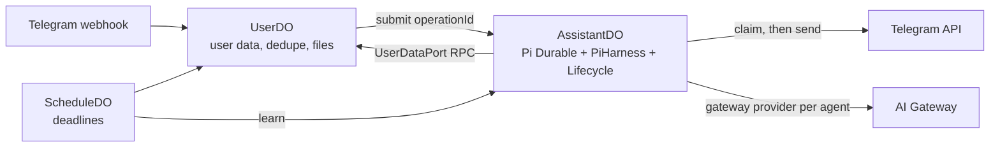

# The agent harness: Pi Durable in AssistantDO

**Every Zero agent runs in one per-user Durable Object, `AssistantDO`, on
[Pi Durable](https://earendil.com/posts/pi-durable/) (`@earendil-works/pi-durable`),
hosted by Cloudflare's `PiHarness` and `Lifecycle` from the Agents SDK
(`agents/harness/pi`, `agents/lifecycle`).** Pi Durable owns the agent loop,
the transcript, follow-up queuing, model retries, crash recovery and
compaction. Zero owns the prompts, the tools, the topic model, Telegram
delivery and learning policy. UserDO keeps the user's data and hands every
message to AssistantDO.

This document is the source of truth for that integration. The topic model and
the agents' jobs live in [`topics.md`](topics.md).

## Objects

- **UserDO** owns topics, settings, files, schedules, mail threads and the
  Telegram link. It no longer runs agents and has no turn alarm.
- **AssistantDO** (`src/AssistantDO/index.ts`) runs the interface agent, the
  learner, onboarding and admin tasks. Pi's tables live in its SQLite with a
  `pi_` prefix; Lifecycle keeps its job queue in `cf_agents_jobs`; Zero's own
  bookkeeping (`assistant_*` tables) sits next to them.
- **ScheduleDO** keeps every deadline. Learning deadlines now go to
  `AssistantDO.learn`; schedules, mail and wake go to UserDO, which hands their
  text to AssistantDO.

A separate object keeps the beta runtime away from user data: if Lifecycle or
Pi fails, settings, MCP and the web app keep working. The cost is an RPC to
UserDO for every tool call that touches user data, and one per model request
(pinned topics, knowledge version, timezone, country).

## Code map

| Module | Role |
|---|---|
| `src/AssistantDO/index.ts` | Hosting: `PiHarness`, Lifecycle, the `Courier` capability, RPC methods, production adapters |
| `src/assistant/assistant.ts` | The core: chat sessions, Telegram outbox, settlement and fallbacks, learning jobs, admin and onboarding jobs |
| `src/assistant/harness.ts` | `buildZeroRegistry` / `openZeroHarness`: one extension per agent, run settings, hooks |
| `src/assistant/tools.ts` | zod `AgentTool` → Pi `ToolRegistration`, replay classes, the memo guard |
| `src/assistant/toolsets.ts` | Each agent's tool set, built per conversation |
| `src/assistant/models.ts` | pi-ai `Models` with one AI Gateway provider per agent label |
| `src/assistant/user-data.ts` | `UserDataPort`: the agent's only view of UserDO's data |
| `src/assistant/ledger.ts` | AssistantDO's own tables: chat map, delivery claims, tracked operations |
| `src/assistant/legacy-import.ts` | One-time move of UserDO's legacy transcripts into Pi sessions |

## Hand-off

Every input reaches AssistantDO with an `operationId`, which is Pi's
`requestId`: submitting the same id twice is one submission. UserDO records its
own side only after the submit succeeds, so a failure anywhere is retried into
the same submission.

| Source | `operationId` | Order in UserDO |
|---|---|---|
| Telegram message | `tg:<updateId>` | skip if processed → save files → compose text once per update (first-contact claim and stored text commit together) → submit → `markProcessed` |
| Schedule | `schedule:<scheduleId>:<dueAt>` | submit → advance or retire |
| Mail reply | `mail:<threadId>:<historyId>` | submit → mark notified → move the watermark |
| Wake | `wake:<lastActiveAt>` | submit → write `wokeAt` |
| Legacy owed message | `legacy:<conversationId>:<rowId>` | from the import |

User text carries its `[YYYY-MM-DD HH:MM]` stamp from the moment it is
composed, so history stays byte-stable. `/new` resets the chat's Pi session
(`pi.reset`) and keeps it; older entries stay in storage for learning.

A message that arrives while a run is working is queued as a follow-up and
answered by the next run; `followUpMode: "all"` turns a burst into one run.

## The harness definition

`buildZeroRegistry` installs four extensions and selects one per session:

| Extension | Sections | Tools | Hooks |
|---|---|---|---|
| `zero-interface` | interface prompt, pinned topics | the interface tool set | staleness + current-time line (`beforeRequest`), step cap, usage, Zero's compaction summary |
| `zero-learner` | learner prompt | topic tools | step cap, usage, compaction declined |
| `zero-onboarding` | onboarding prompt | topic tools, `gmail_search`, `gmail_thread` | same |
| `zero-admin` | admin prompt | topic tools | same |

- **Staleness.** A topic read (`list_topics`, `get_topic`, `list_backlinks`)
  whose result carries an older knowledge version is replaced by the stale stub
  for that request only.
- **Current time.** The time, timezone and country line goes on the newest user
  message of each request, never on history.
- **Step cap.** After 200 tool rounds in one run, every further call is blocked
  with a message telling the model to answer.
- **Usage.** Each model response is written to the `AI_USAGE` dataset once,
  guarded by a memo keyed by response id.
- **Compaction.** Blocking compaction starts at a 45,000-token context
  (`ZERO_CONTEXT_BUDGET_TOKENS`; `reserveTokens = contextWindow - budget`), with
  background compaction a quarter of the budget earlier. The summary comes from
  Zero's compaction prompt (never copy a topic body) and is memoized; starting a
  compaction also asks for a `size` learning run.
- **Retries.** Pi retries a failed model request twice (`settings.retry`), and
  the provider retries twice inside one attempt (`stream.maxRetries`).

Each conversation has its own provider `sessionId` (in `pi.provider`), which
pi-ai sends for prompt-cache affinity.

## Models

`createGatewayModels` registers one pi-ai provider per agent label
(`zero-interface`, `zero-learner`, `zero-compaction`, `zero-onboarding`,
`zero-admin`). Each carries the whole gateway catalog plus `gpt-6-luna`, with:

- `cf-aig-metadata: {"user_id": ..., "agent": ...}` on every model, so gateway
  logs and spend split by agent;
- `maxTokens` capped at 32,000;
- `LLM_BASE_URL_OVERRIDE` as the base URL when set (e2e);
- credentials from the Worker env through `createModels({ authContext })`.

Model and effort per agent still come from `resolveModelSpec`
(`src/agents/model.ts`).

## Tools and replay

Pi commits a tool call's intent before it runs. After a crash it reruns a call
only when the tool is replay-safe; otherwise the model reads "interrupted and
may have partially run", and a published crash test
(<https://www.withone.ai/blog/pi-durable-crash-safe-one-cli>) showed a model
retrying after that message and duplicating a Gmail draft. So every Zero tool is
registered replay-safe, and the ones that change the world carry Zero's memo
guard:

| Class | Tools | On a rerun |
|---|---|---|
| Plain | reads, topic writes, `set_timezone`, `set_country`, mail-watch tools, `cancel_schedule`, `delete_file` | runs again; topic writes conflict on their expected version instead of duplicating |
| Guarded | `gmail_send`, `gmail_send_draft`, `gmail_draft`, `gmail_save_attachment`, `calendar_create_event`, `drive_upload`, `drive_import`, `drive_create_folder`, `send_file`, `create_schedule` | returns the recorded result; a call that started and never recorded one returns "outcome unknown, do not retry" |

The guard writes `zero.started` before the call and `zero.result` after it,
both as Pi memos on the tool task. A throw is reported as an unknown outcome
unless the adapter raised `ExternalCallNotSent`, which proves nothing was sent.

## Telegram delivery

Pi shows nothing to anyone, so delivery is Zero's. The rule: **a text block is
sent only after its entry is committed, and only after its claim is
committed.**

- A commit listener sees every committed `pi.assistant` entry and flushes that
  chat: each non-empty text block of a `stop`, `length` or `toolUse` response is
  claimed in `assistant_deliveries`, then sent. A block already claimed is
  skipped (`delivery_skipped`). Cut-off responses (`error`, `aborted`) are never
  delivered.
- An acknowledgment the model writes before its tools runs is delivered before
  those tools run.
- When a chat submission settles, the outbox flushes once more and decides on a
  fallback: an `unanswered` submission (other than `aborted`, `reset`, `stale`),
  or a `done` one whose run delivered no text, gets `FALLBACK_MESSAGE`, or
  `RATE_LIMIT_MESSAGE` when the provider error carries a 429 or 529. Failures
  are reported to ZeroErrors at today's levels.
- The `Courier` capability keeps a Lifecycle job (`assistant-check`) armed every
  30 seconds while any operation is unsettled. It re-runs the flush and
  settlement, so a restart between a commit and its send still delivers.
- The typing action repeats every 4 seconds while a chat has an unsettled
  submission.

A reset between a claim and its send loses that one message, the same
at-most-once trade as before.

## Execution and recovery

`PiHarness` keeps one Lifecycle job per session with live work. The job waits on
the session inside an alarm at most 10 minutes per invocation and beats every 30
seconds; a Pi wait longer than 60 seconds (retry backoff) is handed to the
alarm. After an eviction, a crash or a deploy, the next heartbeat restarts the
object, Pi reopens its storage, turns every `running` task back into `pending`,
and continues: an interrupted model request is sent again, and an interrupted
replay-safe tool runs again.

One model request that streams longer than 15 minutes can be cut off (the alarm
limit); `REQUEST_TIMEOUT_MS` is 5 minutes.

## Learning

A learning run is a learner session in AssistantDO.

- **Triggers.** ScheduleDO's idle deadline calls `AssistantDO.learn("idle")`.
  Starting a compaction calls `learn("size")` locally.
- **Jobs.** One active job with at most one queued successor
  (`do/learning-job.ts`), stored in `assistant_values`.
- **Input.** Entries of every chat session after its `consolidated_through`,
  rendered as the learner prompt and bounded to 40,000 estimated tokens. A job
  that fills the budget asks for a successor.
- **Completion.** When the learner's submission settles `done`, each session's
  `consolidated_through` moves to the last entry the learner was shown. A failed
  run is reported and leaves the marks where they were.

Raw entries stay in Pi's storage after compaction, so learning never races
compaction.

## Onboarding and admin tasks

UserDO keeps their status machines (`do/onboarding.ts`, `do/admin-task.ts`) and
calls `AssistantDO.runJob`, which runs one session per job and waits for its
answer. Job ids are stable per queued run (`admin:<taskId>`,
`onboarding:<runId>`), so a retried dispatch waits on the same run instead of
starting another.

## Legacy import

The first time an AssistantDO is used, before any submit, learn or job, it
pulls every UserDO conversation through `agentExportLegacy` and writes one Pi
session per conversation in one commit:

1. unconsolidated rows before the compaction boundary (learnable, hidden from
   the model by the reset that follows);
2. a `pi.reset` carrying the old summary, when there was one;
3. the rows after the boundary.

Imported replies count as delivered. A user message that never got a terminal
answer, and every message still queued in `pending_messages`, is submitted again
(`legacy:` operation ids). The import is marked done in `assistant_values` and
skipped afterwards. UserDO's own alarm now only triggers the import, so a turn
that was in flight at the deploy is answered.

`POST /api/admin/assistant-import` runs the import for every Clerk user now
instead of on their next message (`assistant_import_finished` logs the count).

**Follow-up (Phase 5).** After a week without a `turn_failed` increase, and after
that backfill has imported every user, delete the import, `agentExportLegacy`,
the legacy store methods and the `messages`, `pending_messages`, `deliveries`,
`external_calls` and `learning_jobs` tables. Rolling back to a version from
before AssistantDO is not supported.

## Verification

- **Node** (`pnpm --filter @zero/api run test`): the core and the harness
  definition run over Pi's `MemoryStorage` or node SQLite with pi-ai's `faux`
  model — delivery order, acknowledgments before tools, exactly-once inputs,
  follow-up batching, fallbacks, staleness, `/new`, delivery after a restart,
  learning, admin jobs, the memo guard and the legacy import.
- **workerd** (`pnpm --filter @zero/api run test:workers`, also in CI):
  `AssistantDO` and `UserDO` on `PiHarness` and Lifecycle — a handed-off message
  is answered, a repeated update is answered once, a request cut off by a crash
  (`ctx.abort()`) is sent again and answered once, and an idle object keeps no
  alarm. These cannot run on a NixOS box that cannot start `workerd`.
- **E2E** (`bin/e2e-test`): hello, attachments and rate limit, through the
  gateway provider against the mock OpenAI server.

Findings from the spike:

- The Worker bundle grew from 3,050 KB to 3,922 KB (644 KB to 825 KB gzipped).
- In the workerd test runtime, Pi's background work after an alarm returns only
  advances while the object receives events. In production the 30-second
  heartbeat alarm supplies them; the crash test polls the object instead.

## Logs

`turn_started` (submitted), `interface_completed` (settled, with status and
reason), `turn_completed`, `turn_failed` / `turn_rate_limited`,
`delivery_skipped`, `telegram_delivery_failed`, `learn_started`,
`learn_completed`, `learn_failed`, `legacy_import_completed`,
`assistant_work_failed`, `assistant_start_failed`.

## Versions

`agents`, `@earendil-works/pi-durable`, `@earendil-works/pi-ai` and
`@earendil-works/chord` are pinned to exact versions in `apps/zero-api`:
`PiHarness` is beta and Lifecycle and Pi Durable are experimental, and their
APIs change without notice. To upgrade, bump all four together, read their
changelogs, and run the node tests, the workerd tests and the e2e suite. Every
call into `agents` and Pi stays inside `src/assistant/` and `src/AssistantDO/`.

## Prior art

- Cloudflare `PiHarness`: <https://developers.cloudflare.com/agents/harnesses/pi/>
  and <https://developers.cloudflare.com/changelog/post/2026-10-02-pi-harness/>.
- Pi Durable: <https://earendil.com/posts/pi-durable/> and `packages/durable` in
  `earendil-works/pi`.
